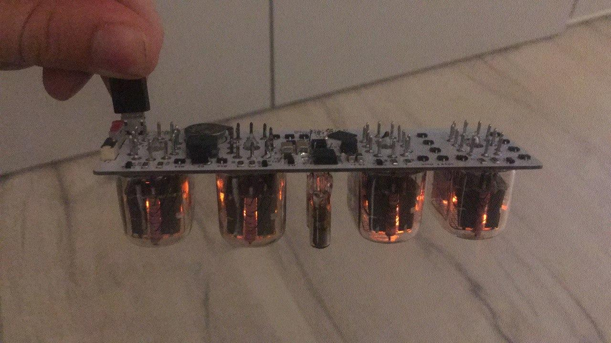
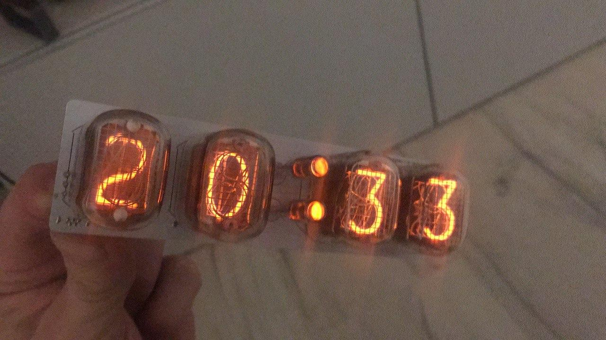

# Nixie_moch

You are not permitted to use this design commercially.
This work is licensed under a Attribution-NonCommercial-ShareAlike 4.0 International (CC BY-NC-SA 4.0) License.

## Description

This is a tiny IN-12 Nixie clock based on STM32. Every SMD component is placed on the bottom side of the PCB. Hardware works with 5 V USB power supply. Boost converter is regulated and driven by STM32.
This project is in beta phase.

## TODO: Write explanation

You are not permitted to use this design commercially.
This work is licensed under a Attribution-NonCommercial-ShareAlike 4.0 International (CC BY-NC-SA 4.0) License.

